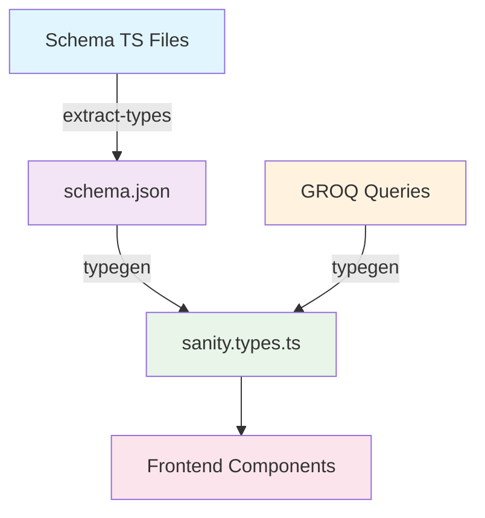

# Sanity Schema Update Workflow

This document explains the complete workflow for updating Sanity schemas and maintaining TypeScript type safety in the Brainchild Building Solutions project.

## Overview

When you modify Sanity schemas, you must follow a specific sequence to ensure TypeScript types stay synchronized across the monorepo. This two-step process converts TypeScript schema definitions into JSON, then generates frontend TypeScript types.

## The Complete Flow

### 1. **Schema Definition** (`studio/src/schemaTypes/`)

Start by modifying your schema TypeScript files:

```typescript
// studio/src/schemaTypes/documents/aboutPage.ts
import {defineField, defineType} from 'sanity'

export const aboutPage = defineType({
  name: 'aboutPage',
  fields: [
    defineField({
      name: 'markStartedYear',
      title: "Year Mark Started in Industry", 
      type: 'number',
      validation: (Rule) => Rule.required().min(1900).max(new Date().getFullYear()),
    }),
    // ... other fields
  ]
})
```

**At this stage:** Your changes exist only in TypeScript - Sanity Studio doesn't know about them yet.

### 2. **Schema Extraction** (`studio/`)

Extract your TypeScript schema into JSON format:

```bash
cd studio
npm run extract-types
# OR directly:
sanity schema extract --enforce-required-fields
```

**What this does:**
- Reads all TypeScript schema files in `src/schemaTypes/`
- Processes `defineField()` and `defineType()` calls
- Generates/updates `studio/schema.json`
- Validates required fields and schema structure

**Output:** `studio/schema.json` contains JSON representation:
```json
{
  "types": [
    {
      "name": "aboutPage",
      "type": "document",
      "fields": [
        {
          "name": "markStartedYear",
          "type": "number",
          "validation": [
            {
              "flag": "required"
            }
          ]
        }
      ]
    }
  ]
}
```

### 3. **Update Frontend Queries** (`frontend/sanity/lib/queries.ts`)

**CRITICAL:** All GROQ queries must be centralized in `frontend/sanity/lib/queries.ts`. Never define queries directly in component files.

Add new fields to your GROQ queries:

```typescript
// frontend/sanity/lib/queries.ts
export const aboutPageQuery = defineQuery(`
  *[_type == "aboutPage"][0]{
    title,
    companyStory,
    markStartedYear,        // ← Add new field
    companyEstablishedYear, // ← Add new field
    personalInterests,      // ← Add new field
    whatSetsMarkApart,      // ← Add new field
    serviceArea
  }
`);
```

**Important:** 
- New schema fields won't appear in generated types unless your GROQ queries actually fetch them
- Duplicate queries in components will cause conflicting type definitions
- Always import queries from the centralized file:

```typescript
// ✅ Correct - Import centralized query
import { aboutPageQuery } from "@/sanity/lib/queries";

// ❌ Wrong - Duplicate query definition
const aboutPageQuery = defineQuery(`...`);
```

### 4. **Frontend Type Generation** (`frontend/`)

Generate TypeScript types for the frontend:

```bash
cd frontend
npm run typegen
# OR directly:
sanity typegen generate
```

**What this does:**
- Reads `studio/schema.json` (not the TypeScript schema files)
- Analyzes GROQ queries in `sanity/lib/queries.ts`
- Generates `frontend/sanity.types.ts` with precise TypeScript interfaces
- Creates both document types and query result types

**Output:** `frontend/sanity.types.ts` gets updated:
```typescript
export type AboutPage = {
  _id: string;
  _type: "aboutPage";
  title: string;
  markStartedYear: number;        // ← New field from schema
  companyEstablishedYear: number; // ← New field from schema
  personalInterests?: Array<string>;
  whatSetsMarkApart?: Array<string>;
  // ... other fields
};

export type AboutPageQueryResult = {
  title: string;
  markStartedYear: number | null; // ← Based on actual GROQ query
  companyEstablishedYear: number | null;
  personalInterests: Array<string> | null;
  whatSetsMarkApart: Array<string> | null;
  // ... only fields included in your query
} | null;
```

### 5. **Update Frontend Components**

Use the new types in your components:

```typescript
// frontend/app/about/page.tsx
export default async function AboutPage() {
  const { data: aboutData } = await sanityFetch({
    query: aboutPageQuery,
  });

  // Now TypeScript knows about the new fields
  const yearsOfExperience = currentYear - (data.markStartedYear || 1989);
  const personalInterests = data.personalInterests || fallbackArray;
}
```

## Dependency Flow



## When You Need Each Step

### **Always run `extract-types` when:**
- ✅ Adding/removing schema fields
- ✅ Changing field types (string → number, etc.)
- ✅ Adding/removing validation rules
- ✅ Adding new document types
- ✅ Modifying field names
- ✅ Changing required/optional status

### **Always run `typegen` when:**
- ✅ After extracting schema types
- ✅ Modifying GROQ queries
- ✅ Before TypeScript compilation
- ✅ Before building the frontend

### **You might skip extraction when:**
- ❌ Only changing field titles/descriptions (UI labels)
- ❌ Only modifying Sanity Studio UI configuration
- ❌ Only updating component logic (no schema changes)

## Project Automation

Your project has built-in automation to help:

### Root Level (`package.json`)
```json
{
  "scripts": {
    "type-check": "npm run typegen --workspace=frontend && tsc --noEmit --project frontend/tsconfig.json"
  }
}
```

### Studio (`studio/package.json`)
```json
{
  "scripts": {
    "prebuild": "npm run extract-types",
    "extract-types": "sanity schema extract --enforce-required-fields"
  }
}
```

### Frontend (`frontend/package.json`)
```json
{
  "scripts": {
    "prebuild": "npm run typegen",
    "typegen": "sanity typegen generate"
  }
}
```

## Recommended Workflow

### **For Schema Changes:**
```bash
# 1. Edit schema files
vim studio/src/schemaTypes/documents/aboutPage.ts

# 2. Extract schema (run from studio/ directory)
cd studio && npm run extract-types

# 3. Update queries if needed (run from frontend/ directory)
vim frontend/sanity/lib/queries.ts

# 4. Regenerate types (run from frontend/ directory)
cd frontend && npm run typegen

# 5. Update components
vim frontend/app/about/page.tsx

# 6. Verify everything works (run from root)
cd .. && npm run type-check

# 7. Test the build
npm run build
```

### **Quick Verification:**
```bash
# From project root - runs both steps automatically
npm run type-check
```

## Common Issues & Solutions

### **Problem:** Duplicate/conflicting type definitions
**Solution:**
1. Ensure all queries are centralized in `frontend/sanity/lib/queries.ts`
2. Remove any duplicate query definitions from component files
3. Import queries instead of defining them locally
4. Run `npm run typegen` to regenerate clean types

### **Problem:** New schema field doesn't appear in TypeScript types
**Solution:** 
1. Ensure you ran `extract-types` in the studio
2. Add the field to your GROQ query in the centralized `queries.ts` file
3. Run `typegen` in the frontend

### **Problem:** TypeScript errors after schema changes
**Solution:**
1. Verify `schema.json` was updated
2. Check that GROQ queries include new fields
3. Regenerate types with `npm run typegen`
4. Update component code to use new field names

### **Problem:** Build fails with type errors
**Solution:**
1. Run the full workflow: extract → typegen → type-check
2. Check for missing required fields in fallback data
3. Ensure proper type annotations in components

### **Problem:** Sanity Studio doesn't show new fields
**Solution:**
1. Restart the studio development server
2. Check for schema validation errors
3. Ensure the field is properly exported in the schema index

## Pro Tips

1. **Always extract before typegen** - Frontend type generation depends on `schema.json`

2. **Update queries when adding fields** - New schema fields won't appear in generated types unless your GROQ queries fetch them

3. **Use the automated scripts** - The `prebuild` hooks and `type-check` script handle the workflow automatically

4. **Validate with `--enforce-required-fields`** - This ensures required fields are properly typed and prevents runtime errors

5. **Restart development servers** - After schema changes, restart both studio and frontend dev servers

6. **Check generated files** - Look at `schema.json` and `sanity.types.ts` to verify your changes were processed correctly

7. **Use TypeScript strict mode** - It will catch type mismatches early in development

## File Locations Reference

| File/Directory | Purpose |
|----------------|---------|
| `studio/src/schemaTypes/` | TypeScript schema definitions |
| `studio/schema.json` | Generated JSON schema (auto-generated) |
| `frontend/sanity/lib/queries.ts` | GROQ queries |
| `frontend/sanity.types.ts` | Generated TypeScript types (auto-generated) |
| `frontend/app/*/page.tsx` | Components using the types |

## Type Safety Benefits

Following this workflow ensures:
- ✅ **Compile-time safety** - TypeScript catches field name typos
- ✅ **Auto-completion** - IDEs provide intelligent suggestions
- ✅ **Refactoring safety** - Field renames are caught across the codebase
- ✅ **Documentation** - Types serve as living documentation
- ✅ **Runtime reliability** - Fewer null/undefined errors in production

---

*Last Updated: July 23, 2025*  
*This workflow is specific to the Brainchild Building Solutions Next.js + Sanity project*