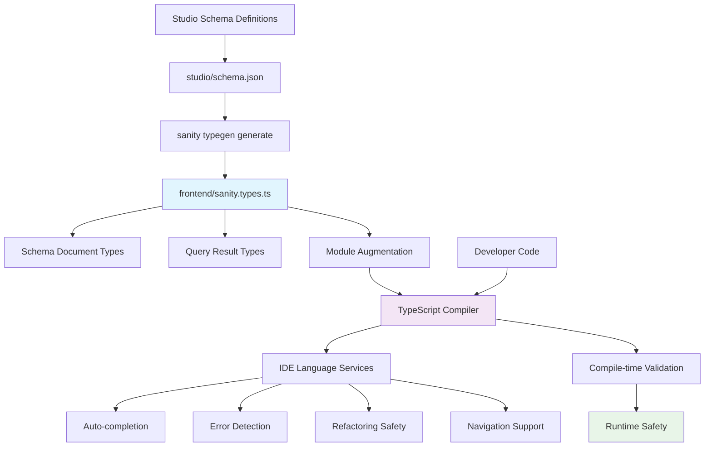

# Sanity TypeScript Integration: How `sanity.types.ts` Powers Development

This document explains how the auto-generated `frontend/sanity.types.ts` file integrates with TypeScript's type system to provide type inference, development assistance, and compile-time safety for Sanity CMS operations.

## Overview

The `sanity.types.ts` file serves as the bridge between your Sanity schema definitions and TypeScript's type system, enabling:

- **Automatic type inference** for all Sanity data operations
- **Compile-time error detection** for data access patterns
- **Rich IDE support** with auto-completion and navigation
- **Refactoring safety** across your entire codebase
- **Zero runtime overhead** - pure development-time benefits

---

## 1. Module Declaration Augmentation

### **The Core Mechanism (Lines 1206-1220)**

The most powerful feature is **module augmentation** at the bottom of the file:

```typescript
// Lines 1206-1220 in sanity.types.ts
declare module "@sanity/client" {
  interface SanityQueries {
    "*[_type == \"aboutPage\"][0]{...}": AboutPageQueryResult;
    "*[_type == \"settings\"][0]{...}": SettingsQueryResult;
    // ... exact GROQ query string → result type mappings
  }
}
```

**What this accomplishes:**
- **Extends** the `@sanity/client` module's existing type definitions
- **Maps** exact GROQ query strings to their corresponding result types
- Provides **automatic type inference** when using `sanityFetch()`
- Enables **compile-time validation** of query results

### **How TypeScript Resolves Types**

```typescript
// When you write this in a component:
const { data: aboutData } = await sanityFetch({
  query: aboutPageQuery,  // ← Contains exact GROQ string
});

// TypeScript automatically:
// 1. Extracts the GROQ string from aboutPageQuery
// 2. Matches it against the SanityQueries interface
// 3. Returns the corresponding AboutPageQueryResult type
// 4. Infers: aboutData: AboutPageQueryResult | null
```

---

## 2. Automatic Type Inference in Practice

### **Immediate Benefits**

```typescript
const { data } = await sanityFetch({ query: aboutPageQuery });

// TypeScript knows all available fields without manual typing:
data?.title              // ✅ string
data?.markStartedYear    // ✅ number  
data?.personalInterests  // ✅ Array<string> | null
data?.invalidField       // ❌ TypeScript error: Property doesn't exist!
```

### **Deep Object Navigation**

```typescript
// Complex nested structures are fully typed:
const imageUrl = data?.teamMembers?.[0]?.image?.asset?.url;
//                    ↑          ↑     ↑      ↑      ↑
//              Array<T>      obj    obj    obj   string | null

// TypeScript tracks the type through the entire chain
```

### **Null Safety Enforcement**

```typescript
// ❌ TypeScript Error: Object is possibly 'null'
const title = data.title;

// ✅ Correct: Null-safe access
const title = data?.title ?? 'Default Title';

// ✅ Alternative: Type guard
if (data) {
  const title = data.title; // TypeScript knows data is not null here
}
```

---

## 3. Development Experience Enhancements

### **Auto-completion**

Your IDE provides intelligent suggestions based on actual schema fields:

```typescript
const aboutData = await sanityFetch({ query: aboutPageQuery });

// Typing 'aboutData.' shows:
// - title: string
// - companyStory: BlockContent | null  
// - markStartedYear: number
// - personalInterests: Array<string> | null
// - [all other fields from your actual query]
```

### **Error Detection**

```typescript
// ❌ Compile-time error: Using old field name
const years = data.yearsInBusiness; // Property doesn't exist

// ✅ Correct field name
const years = data.markStartedYear;

// ❌ Type mismatch error
const calculation = data.markStartedYear + "1989"; // string + number

// ✅ Correct types
const calculation = data.markStartedYear + 1989;
```

### **Refactoring Safety**

When you rename a field in your schema:

1. **Update schema** → `studio/src/schemaTypes/documents/aboutPage.ts`
2. **Extract types** → `npm run extract-types`
3. **Regenerate frontend types** → `npm run typegen`
4. **TypeScript immediately flags** all usages of the old field name
5. **IDE helps rename** all occurrences across your codebase

---

## 4. Internal TypeScript Mechanisms

### **Template Literal Types**

TypeScript uses sophisticated type mapping to connect GROQ queries to results:

```typescript
// Your query definition:
export const aboutPageQuery = defineQuery(`
  *[_type == "aboutPage"][0]{
    title,
    markStartedYear,
    personalInterests
  }
`);

// TypeScript maps the literal string to:
interface SanityQueries {
  "*[_type == \"aboutPage\"][0]{title,markStartedYear,personalInterests}": AboutPageQueryResult;
}
```

### **Conditional Type Resolution**

The `sanityFetch` function uses advanced TypeScript generics:

```typescript
// Simplified version of the actual implementation:
function sanityFetch<T extends keyof SanityQueries>(
  options: { query: T }
): Promise<{ data: SanityQueries[T] }> {
  // TypeScript automatically resolves T to the exact query string
  // Returns the precisely mapped result type
}
```

### **Union Type Handling**

```typescript
// Lines 829 - Union of all possible Sanity document types
export type AllSanitySchemaTypes = 
  CallToAction | Link | InfoSection | BlockContent | 
  Service | Project | Testimonial | Product | 
  ContactPage | AboutPage | HomePage | Settings | 
  Page | Post | Person | /* ... */;

// Used for generic Sanity operations:
function createDocument<T extends AllSanitySchemaTypes>(doc: T): T {
  // TypeScript ensures T is a valid Sanity document type
  return doc;
}
```

---

## 5. Schema Types vs Query Result Types

### **Schema Types: Complete Document Structure**

```typescript
// Lines 286-337: AboutPage document type
export type AboutPage = {
  _id: string;
  _type: "aboutPage";
  _createdAt: string;
  _updatedAt: string;
  _rev: string;
  title: string;
  companyStory?: Array<BlockContent>;
  markStartedYear: number;
  companyEstablishedYear: number;
  personalInterests?: Array<string>;
  whatSetsMarkApart?: Array<string>;
  // ... ALL possible fields defined in schema
};

// Used for: Complete document operations
function updateAboutPage(doc: AboutPage): Promise<AboutPage> {
  // TypeScript enforces the complete document structure
  return sanityClient.createOrReplace(doc);
}
```

### **Query Result Types: Only Queried Fields**

```typescript
// Lines 1132-1177: AboutPageQueryResult
export type AboutPageQueryResult = {
  title: string;
  companyStory: Array<BlockContent> | null;
  missionStatement: string | null;
  teamMembers: Array<{
    name: string;
    role: string;
    bio: string | null;
    // ...
  }> | null;
  markStartedYear: number;
  companyEstablishedYear: number;
  personalInterests: Array<string> | null;
  whatSetsMarkApart: Array<string> | null;
  serviceArea: string | null;
} | null; // ← Entire result can be null (no document found)

// Used for: Query result handling
const { data } = await sanityFetch({ query: aboutPageQuery });
// data is typed as AboutPageQueryResult
```

### **Key Differences**

| Schema Types | Query Result Types |
|--------------|-------------------|
| **All schema fields** | **Only queried fields** |
| **Never null** (document exists) | **Can be null** (query might return nothing) |
| **Sanity metadata** (`_id`, `_createdAt`, etc.) | **Only fields in GROQ query** |
| **Used for**: Document mutations | **Used for**: Data fetching |

---

## 6. IDE Integration Features

### **IntelliSense Support**

- **Field suggestions** based on actual query results
- **Error highlighting** for invalid field access
- **Type tooltips** showing field types on hover
- **Parameter hints** for function calls

### **Navigation Support**

```typescript
// Ctrl+Click (or Cmd+Click) on any field:
data?.markStartedYear
//    ↑ Jumps to line 1172 in sanity.types.ts

// Shows: markStartedYear: number;
```

### **Refactoring Tools**

- **Rename Symbol** (F2) - Renames field across entire project
- **Find All References** - Shows all usages of a field
- **Go to Definition** - Navigates to type definition
- **Extract Interface** - Create reusable type definitions

---

## 7. Error Prevention Examples

### **Field Access Errors**

```typescript
// ❌ TypeScript Error: Property 'yearsInBusiness' does not exist on type 'AboutPageQueryResult'
const years = data.yearsInBusiness; // Old field name

// ✅ Correct: Use updated field name
const years = data.markStartedYear;
```

### **Type Mismatch Prevention**

```typescript
// ❌ TypeScript Error: Argument of type 'string' is not assignable to parameter of type 'number'
const calculation = data.markStartedYear + "1989";

// ✅ Correct: Proper type usage
const calculation = data.markStartedYear + 1989;
```

### **Null Reference Protection**

```typescript
// ❌ TypeScript Error: Object is possibly 'null'
const count = data.personalInterests.length;

// ✅ Correct: Null-safe access
const count = data.personalInterests?.length ?? 0;

// ✅ Alternative: Type guard
if (data?.personalInterests) {
  const count = data.personalInterests.length; // Safe here
}
```

### **Array Access Safety**

```typescript
// ❌ TypeScript Error: Object is possibly 'undefined'
const firstName = data.teamMembers[0].name;

// ✅ Correct: Safe array access
const firstName = data.teamMembers?.[0]?.name ?? 'Unknown';
```

---

## 8. Performance Characteristics

### **Zero Runtime Cost**

```typescript
// All type definitions are compile-time only:
export type AboutPage = {
  // This entire definition disappears in JavaScript output
  title: string;
  markStartedYear: number;
  // No runtime JavaScript generated
};

// The compiled JavaScript is just:
const { data } = await sanityFetch({ query: aboutPageQuery });
// No type checking overhead at runtime
```

### **Development Performance Benefits**

- **Instant feedback** while typing (no compilation delay)
- **Reduced debugging time** from catching errors early
- **Faster development cycles** with confident refactoring
- **Reduced QA cycles** from fewer runtime type errors

### **Bundle Size Impact**

- **Zero impact** on production bundle size
- **Tree-shaking friendly** - unused types don't affect output
- **No runtime type checking** libraries needed

---

## 9. Integration with Sanity Ecosystem

### **Live Queries Support**

```typescript
// Works seamlessly with Sanity's live queries:
const { data, loading, error } = useLiveQuery(aboutPageQuery);
//      ↑ Still properly typed as AboutPageQueryResult | null
```

### **Visual Editing Integration**

```typescript
// Types work with Sanity's visual editing:
const { data } = await sanityFetch({
  query: aboutPageQuery,
  stega: { enabled: true } // Visual editing metadata
});
// data remains properly typed despite additional metadata
```

### **GROQ Query Builder**

```typescript
// Future compatibility with query builders:
const query = q("*")
  .filterByType("aboutPage")
  .slice(0)
  .project({
    title: true,
    markStartedYear: true
  });

// Type inference would still work with generated queries
```

---

## 10. Type System Flow Diagram



## 11. Best Practices

### **Schema Design for TypeScript**

```typescript
// ✅ Good: Clear, specific field names
export const aboutPage = defineType({
  fields: [
    defineField({
      name: 'markStartedYear',
      type: 'number',
      validation: Rule => Rule.required()
    }),
    defineField({
      name: 'personalInterests',
      type: 'array',
      of: [{ type: 'string' }]
    })
  ]
});

// ❌ Avoid: Generic or ambiguous names
defineField({
  name: 'data', // Too generic
  name: 'info', // Unclear purpose
  name: 'stuff' // Not descriptive
})
```

### **Query Design for Type Safety**

```typescript
// ✅ Good: Explicit field selection
export const aboutPageQuery = defineQuery(`
  *[_type == "aboutPage"][0]{
    title,
    markStartedYear,
    companyEstablishedYear,
    personalInterests,
    whatSetsMarkApart
  }
`);

// ❌ Avoid: Using spread operators without specific fields
const badQuery = defineQuery(`
  *[_type == "aboutPage"][0]{
    ..., // TypeScript can't infer what fields this includes
  }
`);
```

### **Component Type Usage**

```typescript
// ✅ Good: Let TypeScript infer from sanityFetch
export default async function AboutPage() {
  const { data } = await sanityFetch({ query: aboutPageQuery });
  // TypeScript automatically knows data is AboutPageQueryResult | null
  
  if (!data) return <div>Loading...</div>;
  
  // TypeScript knows data is not null here
  return <h1>{data.title}</h1>;
}

// ❌ Avoid: Manual type annotations (can get out of sync)
const data: AboutPageQueryResult = await sanityFetch({ query: aboutPageQuery });
```

---

## 12. Troubleshooting Common Issues

### **Types Not Updating**

```bash
# Problem: Schema changes not reflected in types
# Solution: Regenerate types in correct order
cd studio && npm run extract-types
cd ../frontend && npm run typegen
```

### **Query Result Mismatch**

```typescript
// Problem: Query returns different fields than expected
// Check: Query string matches the generated type mapping

// In sanity.types.ts, look for your exact query:
// Line 1131: // Query: *[_type == "aboutPage"][0]{...}
// Ensure your GROQ query matches exactly
```

### **IDE Not Showing Types**

```bash
# Problem: IDE not recognizing types
# Solutions:
1. Restart TypeScript service in IDE
2. Check tsconfig.json includes sanity.types.ts
3. Verify no TypeScript errors in the file
4. Clear IDE cache and restart
```

### **Module Augmentation Not Working**

```typescript
// Problem: sanityFetch not showing typed results
// Check: Import paths are correct

// Ensure you're importing from the right location:
import { sanityFetch } from "@/sanity/lib/live";
import { aboutPageQuery } from "@/sanity/lib/queries";

// Not from somewhere else that might not have the augmentation
```

---

## 13. Advanced Type Techniques

### **Generic Query Functions**

```typescript
// Create reusable, type-safe query functions:
async function fetchSingletonPage<T extends keyof SanityQueries>(
  query: T
): Promise<SanityQueries[T]> {
  const { data } = await sanityFetch({ query });
  return data;
}

// Usage with full type safety:
const aboutData = await fetchSingletonPage(aboutPageQuery);
// aboutData is properly typed as AboutPageQueryResult | null
```

### **Conditional Types for Optional Fields**

```typescript
// Create utility types for common patterns:
type NonNullable<T> = T extends null ? never : T;
type RequiredField<T, K extends keyof T> = T & Required<Pick<T, K>>;

// Usage:
type AboutDataWithTitle = RequiredField<AboutPageQueryResult, 'title'>;
// Ensures title is never null/undefined
```

### **Schema-to-Component Type Mapping**

```typescript
// Create component prop types from schema types:
type AboutPageProps = {
  data: NonNullable<AboutPageQueryResult>;
  className?: string;
};

export function AboutPageComponent({ data, className }: AboutPageProps) {
  // data.title is guaranteed to exist and be string
  return <div className={className}>{data.title}</div>;
}
```

---

## Conclusion

The `sanity.types.ts` file transforms your Sanity CMS integration from loosely-typed API calls into a **fully type-safe, IntelliSense-powered development experience**. By leveraging TypeScript's advanced type system features like module augmentation, template literal types, and conditional types, it provides:

- ✅ **Automatic type inference** that eliminates manual type definitions
- ✅ **Compile-time error detection** that catches bugs before runtime
- ✅ **Rich IDE integration** with auto-completion, navigation, and refactoring
- ✅ **Zero performance overhead** with compile-time-only type checking
- ✅ **Schema evolution safety** that guides you through changes

This integration makes working with Sanity data feel like working with **statically-typed, local objects** rather than dynamic API responses, dramatically improving both developer experience and application reliability.

---

*Last Updated: July 23, 2025*  
*Related Documentation: [SANITY_SCHEMA_WORKFLOW.md](./SANITY_SCHEMA_WORKFLOW.md)*